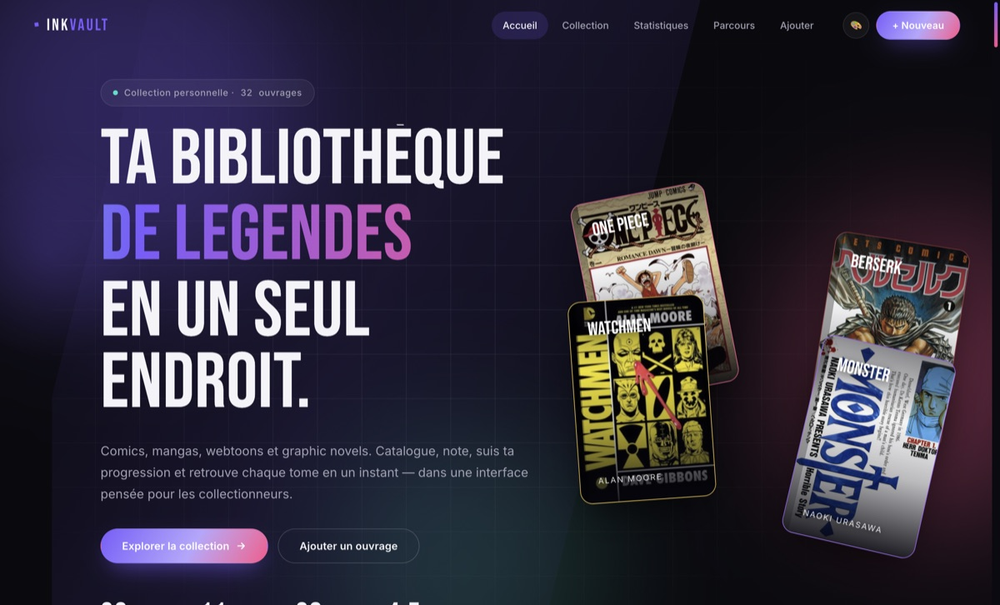
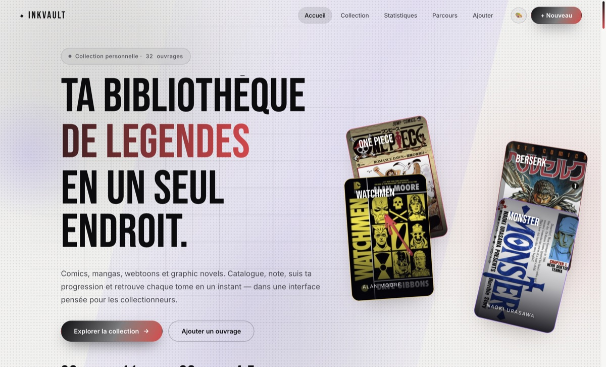
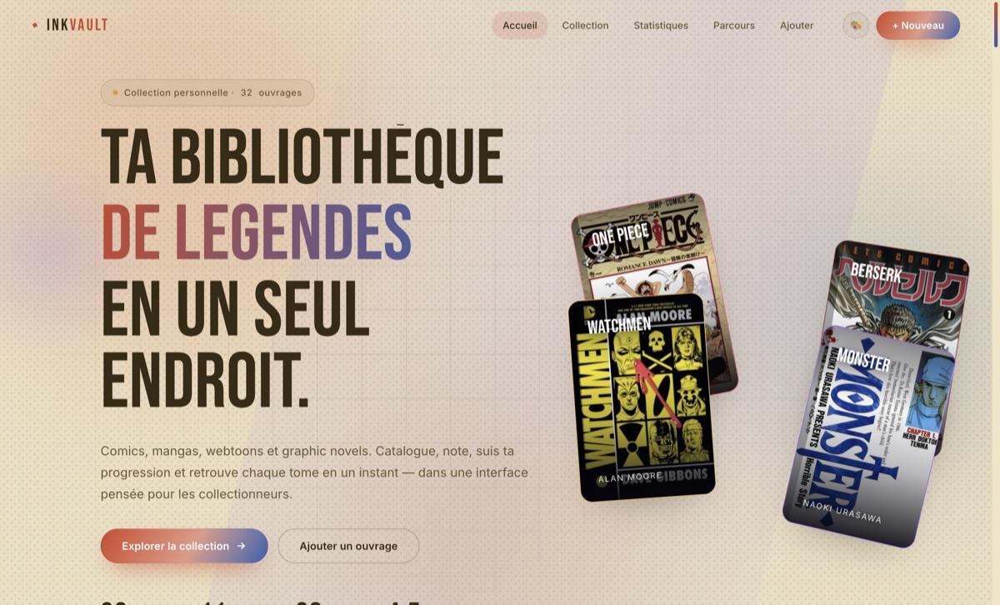
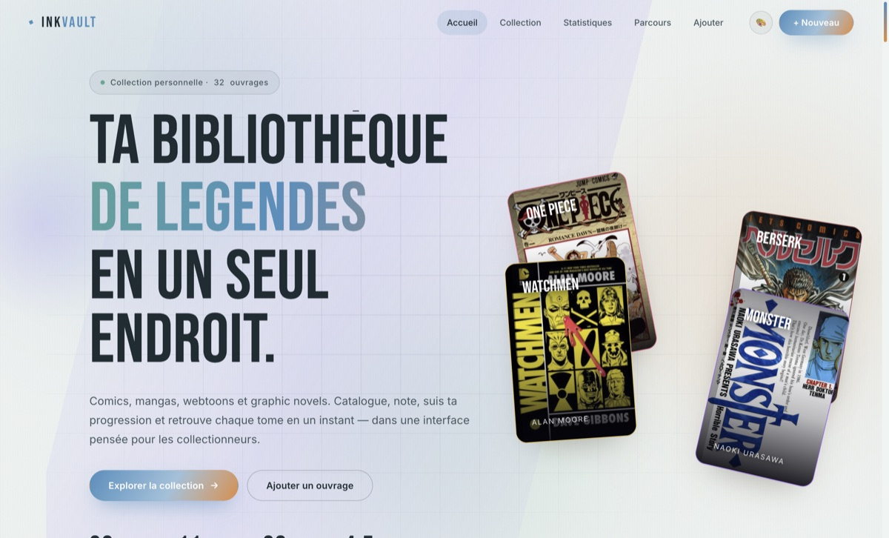
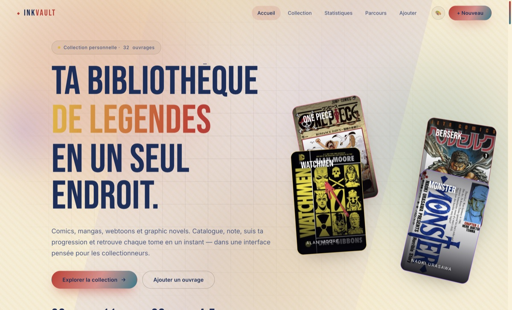

# 📚 InkVault — Bibliothèque Comics & Mangas

[](https://github.com/DmzGamingYT/InkVault/actions/workflows/release.yml)
[](https://github.com/DmzGamingYT/InkVault/releases)
[](LICENSE)


**Comics, mangas et webtoons : catalogue, notes, progression, statistiques — et une IA de recommandation qui tourne localement, enrichie par de vraies API publiques quand elle est en ligne.**
Site statique en HTML/CSS/JS pur + coquille **desktop Electron pour Linux**. Ta bibliothèque est enregistrée localement ; les couvertures, fiches auteurs et polices peuvent nécessiter des requêtes réseau.

## 🎨 Les 6 thèmes graphiques

<table>
  <tr>
    <td align="center" width="50%">
      <br>
      <b>🌙 Gotham</b> — sombre & néons discrets, idéal la nuit
    </td>
    <td align="center" width="50%">
      <br>
      <b>🖋️ Manga Ink</b> — N&B tranché, trames de screentone
    </td>
  </tr>
  <tr>
    <td align="center">
      <br>
      <b>🗞️ Comics Vintage</b> — papier jauni, points Ben-Day
    </td>
    <td align="center">
      <br>
      <b>✏️ Ligne Claire</b> — pastel franco-belge sobre
    </td>
  </tr>
  <tr>
    <td align="center">
      <br>
      <b>🦇 Batman</b> — batsignal doré, bleu nuit
    </td>
    <td align="center">
      <br>
      <b>☀️ One Piece</b> — paille, or & bleu marine
    </td>
  </tr>
</table>

Un clic sur **🎨** dans la barre du haut — le thème s'applique partout et se souvient.

## ✨ Fonctionnalités

- **Catalogue** : grille/liste, filtres, favoris, recherche par titre ou auteur, notes, progression par tome.
- **✦ Recherche par ambiance** : « un seinen sombre avec de la philosophie et de l'encre détaillée » → décomposition en facets + classement par affinité (%).
- **✦ Ordres de lecture hybrides** : fils conducteurs pas-à-pas croisés avec ta bibliothèque, enrichis en temps réel par Open Library et AniList puis structurés par l’IA locale (cache 6 h, repli hors ligne), copiables et exportables.
- **✦ Insights & Profil de lecture** : résumés mensuels générés localement, penchants, suggestion de relecture.
- **✦ Smart Buy** : optimiseur de panier sous budget (knapsack) — « J'ai 50 € » → la meilleure combinaison de tomes.
- **🌐 Fiches Auteurs 360°** : rôles par œuvre (scénario/dessin), style & thèmes, jauge de bibliographie, auteurs similaires, binômes célèbres — **bio Wikipédia et bibliographie complète enrichies en direct** (Open Library + Google Books + MangaDex pour les mangas, cache 7 jours, repli hors ligne sur la base locale).
- **🖼 Fiche livre immersive** : galerie de visuels illustratifs, variantes d'édition persistées, **double timeline** publication vs chronologie d'univers.
- **🛒 Où l'acheter ?** : liens multi-enseignes (Fnac, Amazon, BDFugue, Place des Libraires, Canal BD… + occasion Vinted, Rakuten, momox) avec recherche pré-remplie, prêts pour l'affiliation.
- **⤓ Export** : bibliothèque **et** ordres de lecture en **Markdown** ou **PDF** (dialogue natif sur desktop, boîte d'impression en ligne) + sauvegarde JSON complète.
- **➕ Ajout au clic** : dans la bibliographie live d'un auteur, un clic sur un titre l'ajoute à ta collection ; un ouvrage ajouté peut être retiré directement avec la poubelle. Cliquer sur une couverture l'ouvre dans une visionneuse agrandie.
- **🎨 6 thèmes** : Manga Ink, Comics Vintage, Gotham, Ligne Claire, Batman, One Piece.

## 📦 Installation — Linux

| Format | x86_64 | arm64 |
|---|---|---|
| **AppImage** | `InkVault-*-linux-x86_64.AppImage` | `InkVault-*-linux-arm64.AppImage` |
| **.deb** (Debian/Ubuntu) | `apt install ./inkvault-*-amd64.deb` | `apt install ./inkvault-*-arm64.deb` |
| **tar.gz** portable | `inkvault-*.tar.gz` | `inkvault-*-arm64.tar.gz` |

Tous les fichiers sont sur la **[page des releases](https://github.com/DmzGamingYT/InkVault/releases)**.

> **🚀 Releases automatiques** : chaque tag `v*` déclenche la CI ([`.github/workflows/release.yml`](.github/workflows/release.yml)) qui build les 6 paquets (x64 + arm64) et publie la release — zéro build local.
>
> **🔄 Mises à jour automatiques (AppImage x64 et arm64)** : lance l'AppImage depuis un dossier accessible en écriture (par exemple `~/Applications`), avec une connexion Internet. Au lancement puis toutes les six heures si elle reste ouverte, l'application cherche une nouvelle release GitHub et la télécharge en arrière-plan. Dès la fin du téléchargement, elle ferme et relance automatiquement l'application avec la nouvelle version. **Toute saisie non enregistrée est perdue lors de cette relance** : termine tes modifications avant de laisser l'application ouverte longtemps. Si l'app est fermée avant la fin du téléchargement, elle réessaiera au lancement suivant. Les erreurs sont consignées dans `update-errors.log` dans le dossier de données de l'application.
>
> **Si tu utilises déjà un `.deb` ou un `tar.gz`** : ces formats ne se mettent pas à jour automatiquement ici. Pour ne plus retélécharger les versions à la main, sauvegarde d'abord ta bibliothèque en JSON puis passe **une fois** à l'AppImage correspondant à ton architecture (sur la page des releases). Sinon, il faudrait mettre en place un dépôt APT pour le `.deb`. Si une ancienne installation ne reçoit pas encore les mises à jour, installe une fois la nouvelle AppImage pour amorcer ce mécanisme.

## 🛠 Développement

```bash
git clone https://github.com/DmzGamingYT/InkVault.git && cd InkVault
npm install
npm start                 # app Electron en dev
npm run dist:linux        # AppImage + tar.gz + .deb (x64)
npm run dist:linux:arm64  # idem pour ARM64
```

Pour publier une nouvelle version après validation, incrémenter la version, créer le tag et le pousser :

```bash
npm version patch         # bump package.json + tag vX.Y.Z
git push --follow-tags    # → CI build & publie la release (~5 min)
```

## 📁 Structure

| Chemin | Rôle |
|---|---|
| `src/index.html` | Structure de l’interface |
| `src/styles/` | Design system et thèmes via `data-skin` |
| `src/js/data.js` | Bibliothèque de démonstration |
| `src/js/store.js` | Persistance localStorage |
| `src/js/ai.js` | **Moteur d'IA local** (vibe, reading orders, insights, smart buy, auteurs, timelines) + **enrichissements live** (Wikipédia, Open Library, AniList, Google Books, MangaDex, caches 6 h/7 j) |
| `src/js/covers.js` | Résolution des couvertures (AniList / Jikan / Google Books / Open Library) |
| `src/js/app.js` | Câblage de l'interface |
| `electron/` | Coquille desktop (instance unique, export PDF natif via `preload.js`, confirm système, auto-update) |
| `tests/` | Tests automatisés Node.js |
| `scripts/` | `make-deb.sh` + `mk-ar.py` — fabrique de `.deb` sans fpm (macOS & Linux) |
| `docs/screenshots/` | Captures utilisées par la documentation |
| `.github/workflows/` | `release.yml` — build & publication par tag |

## 🔒 Confidentialité

La bibliothèque, les notes et les calculs de recommandation restent en local. Une connexion est utilisée pour la recherche de couvertures, les ordres de lecture live (Open Library et AniList), l'enrichissement des fiches auteurs, les polices Google au chargement et la recherche de mises à jour sur GitHub (AppImage). Ces services peuvent recevoir les titres/auteurs recherchés et des informations réseau comme l'adresse IP. Les parcours live sont mis en cache 6 heures ; les fiches auteurs disposent d'un cache local de 7 jours et d'un repli hors ligne. MangaDex est utilisé uniquement pour les métadonnées et les couvertures de mangas ; MangaDex est crédité dans l'interface lorsque cette source est active.

## 📝 Licence

MIT — voir [LICENSE](LICENSE).
